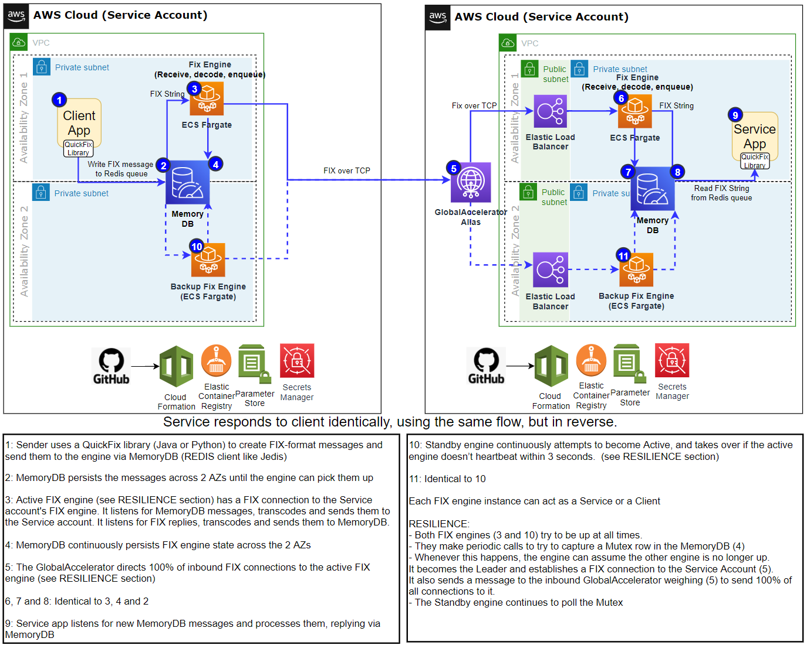
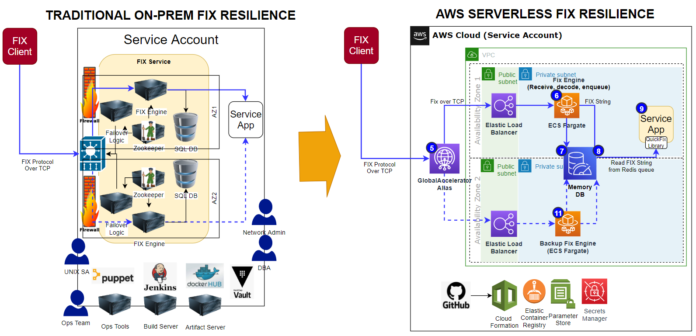

## Resilient FIX Engine on AWS
- Example implementation of an AWS FIX service, which provides automated HA (High Availability) failover, with an RTO (Recovery Time Objective) of seconds in case of failure of the primary engine, and 0 RPO (Recovery Point Objective) meaning no data loss.
- The implementation uses the [QuickFixJ](http://www.quickfixengine.org/) Java-based FIX engine to create FIX connections, and provides the ability to synchronize its state with a hot standby backup engine using a JDBC database.
- The provided Cloud Formation template and FIX encoding/decoding libraries from the QuickFix project can be used to quickly stand up the engine and use Java, Python, C++, Ruby, .NET or GO to use it to send and receive messages with any other FIX engine.
- The solution can be configured either as a FIX server or a FIX client, and creates and configures all the infrastructure required to run, including the primary and backup engine, JDBC database, MSK (Kafka) queue, networking, configuration, security and SDLC components.
- The solution can be reconfigured to run in asynchronous mode using EFS (with near-real-time replication) to achieve higher throughput with a lower RPO

## Vision
-[FIX](https://en.wikipedia.org/wiki/Financial_Information_eXchange) (Financial Information eXchange) is a protocol that allows vastly different institutions, technologies and architectures to communicate financial data to each other with minimal coupling and coordination effort.
- Example of a FIX message : Execution Report (Pipe character is used to represent SOH character): 8=FIX.4.2|9=176|35=8|49=PHLX|56=PERS|52=20071123-05:30:00.000|11=ATOMNOCCC9990900|20=3|150=E|39=E|55=MSFT|167=CS|54=1|38=15|40=2|44=15|58=PHLX EQUITY TESTING|59=0|47=C|32=0|31=0|151=15|14=0|6=0|10=128|
- The FIX protocol has ushered in an era of straight-through processing in capital markets, replacing faxes and phone calls, and allowing firms to exchange data in real time.
- To achieve this, the FIX engine must be highly available and resilient against brief outages as well as data center failures, and allow participants to continue exchanging FIX messages.
- As FIX evolves and is more widely adopted, it holds the promise of allowing real-time processing of all post-trade events such as reconciliations, money movements, settlements, risk calculations and corporate actions.
- Upgrading the protocol and integrating new clients also requires extensive and labor-intensive testing of the proposed FIX infrastructure without disturbing existing Production connectivity.
- This requires an engine architecture that's trivial to set up, tear down, scale horizontally and test in parallel.
- The aim of this project is to provide such a solution.

## Purpose
- Build a cloud-native, highly available resilient FIX engine for financial services industry (FSI) to demonstrate how easy AWS makes it to quickly deploy and easily run complex, real-time services.
- Enable migration of proprietary protocols and low-latency on-prem FSI trading services to AWS.
- Demonstrate how this design pattern can be deployed and used with AWS products and services, with a clear focus on security, scale, and distinguishable operational excellence
- Provide example code that users can adapt to meet this and other similar use cases

## Architecture
- Open-source QuickFix engine and encoding/decoding libraries with Amazon's multi-region [Aurora MySQL](https://aws.amazon.com/rds/aurora/) database and [MSK](https://aws.amazon.com/msk/) (managed Kafka) queues as well as [Fargate](https://aws.amazon.com/fargate/) (managed Docker) containers, resilience and high availability becomes extremely simple to achieve.
- Amazon's [VPC](https://aws.amazon.com/vpc/) (Virtual Public Cloud), [NLB](https://aws.amazon.com/elasticloadbalancing/network-load-balancer/) (Network Load Balancer) and [Global Accelerator](https://aws.amazon.com/global-accelerator/) (intelligent network routing) technologies make it easy to securely expose the FIX service to internal and external users, and route them to the active engine instance.
- [CloudFormation](https://aws.amazon.com/cloudformation/) (infrastructure-as code) and [SSM](https://docs.aws.amazon.com/systems-manager/latest/userguide/ssm-agent.html) (Systems Manager) allow users to automatically create every component required to run a FIX server or client in a matter of minutes, and to reconfigure it without having to recreate it.
- Java engine deployed as a container on [Fargate ECS](https://aws.amazon.com/fargate/) (Managed Elastic Container Service)
- [Multi-AZ](https://aws.amazon.com/rds/features/multi-az/) (Availability Zone), [multi-master](https://docs.aws.amazon.com/AmazonRDS/latest/AuroraUserGuide/aurora-multi-master.html) database (Aurora MySQL) keep primary and secondary engine states in sync
- The secondary engine is kept in hot-standby mode (always running but not processing messages until it detects that it's become the primary)
- Multi-AZ [MSK](https://aws.amazon.com/msk/) (Managed Kafka) allows seamless client failover
- [Global Accelerator](https://aws.amazon.com/global-accelerator/) transparently redirects clients to the currently active FIX engine
- Internal SQL-based heartbeat uses a MySQL database table row as a mutex lock which allows FIX engines to perform leader election without external watchers
- 

## AWS vs. On-Prem Architecture
- AWS managed services vastly simplify the deployment and maintenance of complex components like databases, queues and compute containers
- This is much simpler than deploying the same components on traditional on-prem architectures
- 

## Pre-requisites
- An AWS account
- The FIX port number and (optional for internal testing) DNS name you intend to use (either as a FIX server or client)
- (Optionally) [Domain](https://docs.aws.amazon.com/Route53/latest/DeveloperGuide/domain-register.html) which you control and a [hosted zone](https://docs.aws.amazon.com/Route53/latest/DeveloperGuide/CreatingHostedZone.html), which will be used to create a DNS alias for the FIX server (not required if you are using this solution only as a FIX client).
- (Optionally) An existing [VPC and subnets](https://docs.aws.amazon.com/AmazonECS/latest/developerguide/create-public-private-vpc.html) (one public, one private) where you'd like to run the FIX engine (if you don't have one or would like a new one created, simply run the "VPC" version of the Cloud Formation template included with this project.
- The FIX port number and DNS name you intend to use (either as a FIX server or client)
- Download/install the QuickFix version appropriate for the language and FIX protocol version that's used for your application from [quickfixengine.org/](http://www.quickfixengine.org/)
- Download/install Kafka producer/consumer library appropriate for the language that's used for your application from [cwiki.apache.org/confluence/display/KAFKA/Clients](https://cwiki.apache.org/confluence/display/KAFKA/Clients)
- (Optionally) [Cloud9](https://docs.aws.amazon.com/cloud9/latest/user-guide/setup-express.html) (for building the container image) 
- (Optionally) [ECR](https://docs.aws.amazon.com/AmazonECR/latest/userguide/get-set-up-for-amazon-ecr.html) (for hosting the container image) 

## Installation
- Visit the [AWS Regional Services](https://aws.amazon.com/about-aws/global-infrastructure/regional-product-services/) page to ensure all the required services listed in the Architecture section (particularly Managed Streaming for Apache Kafka) are available in your target region
- If you'd like to create a new VPC and subnets for the FIX engine, download and run this CloudFormation template https://github.com/aws-samples/amazon-resilient-fix-engine-demo/blob/main/cloudformation/FIXEngineVPCApplication.yml
- If you'd like to share an existing VPC and subnets, download and run this CloudFormation template https://github.com/aws-samples/amazon-resilient-fix-engine-demo/blob/main/cloudformation/FIXEngineApplication.yml
- View the Primary and Failover ECS tasks' Log Groups in CloudFormation and see which one's been elected leader
- If you'd like to run the engine on an EC2 instance, ensure it has access to the MySQL, MSK, GlobalAccelerator and SSM services, and that you have Java 1.8 installed, then run:
<code>export APPLICATION_STACK_NAME="<STACK NAME THAT PREFIXES RELEAVANT PARAMETERS FOR THIS APP IN SSM PARAMETER STORE FixEngineOnAws-1-20>" ; export GLOBAL_ACCELERATOR_ENDPOINT_ARN="<GLOBAL ACCELERATOR ARN LIKE: arn:aws:elasticloadbalancing:us-east-1:XXXXXXXXXXXX:loadbalancer/net/FixEn-Failo-BM0E1KC5AQ2K/4df267784903750a>" ; java -jar fixengineonaws.jar <server.cfg OR client.cfg FILE LOCATION></code>

## Usage
- See FixEncoderDecoderDemo.java for an example of how to use QuickFixJ to build an order object, encode it into a FIX string and decode this string back into a new order object
- Use the QuickFix library for your language (link above) to construct a FIX message object and convert it to a FIX String (in Java this is just calling the toString() method)
- Connect to the MSK Kafka queue created by CloudFormation and send this string
- Subscribe to the same MSK Kafka queue to receive FIX reply strings from the target FIX server
- Use the QuickFix library to parse the retreived FIX message back into an object (using the appropriate-version XML template in quickfixj-messages-all-2.2.0.jar)

## Monitoring
- Navigate to CloudWatch to look at logs
- Click on ECS Cluster --> Click on Task Tab --> Click on Task --> Expand the Container and scroll down and click on View logs in CloudWatch
- or Go to CloudWatch and filter by stack name e.g. fixengineonaws-server-1-19
- Log group will be names as /ecs/fargate/FixEngineOnAws-Client-1-19 <stack-Name>
- within the log group, there will be 2 log streams for primary e.g. FixEngineOnAws-Client-1-19/Primary/FixEngineOnAws...... and failover FixEngineOnAws-Client-1-19/Failover/FixEngineOnAws.......

## Testing
- For local testing provision an EC2 or AWS Cloud9 in same VPC where FIX Server and FIX Client Engine is deployed. 
- Install required packages
sudo yum install telnet
sudo yum install jq git docker java-1.8.0-openjdk-devel -y
wget https://archive.apache.org/dist/kafka/2.2.1/kafka_2.12-2.2.1.tgz
tar -xzf kafka_2.12-2.2.1.tgz
sudo wget -c https://services.gradle.org/distributions/gradle-6.6.1-all.zip
sudo unzip gradle-6.6.1-all.zip -d /opt
sudo ln -s /opt/gradle-6.6.1 /opt/gradle
- Update .bash_profile to add below  
export GRADLE_HOME=/opt/gradle
export PATH=$PATH:\/opt/gradle/bin
- Update src/main/resources/config/test-client.cfg and src/main/resources/config/test-server.cfg to update KafkaBootstrapBrokerString, NoOfMessages and WaitBetweenMessages
- Create a local build if you are planning to modify code or you could use the already built jar located at build/libs/fixengineonaws.jar
cd amazon-resilient-fix-engine-demo
gradle build
- Open a terminal window and run the test client on FIX Server side
./scripts/runtestserver.sh
- Open a terminal window and run the test client on FIX Client side 
./scripts/runtestclient.sh 
- Open a terminal window and monitor execution reports received back by FIX Client MSK
export PS1="MSK-Client-1 >"
cd /home/ec2-user/environment/kafka_2.12-2.2.1/bin
export BootstrapBrokerString=<broker-1>:9092,<broker-2>:9092
./kafka-topics.sh --list --bootstrap-server $BootstrapBrokerString
./kafka-console-consumer.sh --bootstrap-server $BootstrapBrokerString --topic FROM-FIX-ENGINE --from-beginning
- Open a terminal window and and ,onitor order received by FIX Server MSK
export PS1="MSK-Server-1 >"
cd /home/ec2-user/environment/kafka_2.12-2.2.1/bin
export BootstrapBrokerString=<broker-1>:9092,<broker-2>:9092
./kafka-topics.sh --list --bootstrap-server $BootstrapBrokerString
./kafka-console-consumer.sh --bootstrap-server $BootstrapBrokerString --topic FROM-FIX-ENGINE --from-beginning

## API Documentation
- You can find the QuickFix Message API documentation here https://javadoc.io/doc/org.quickfixj/quickfixj-core/latest/index.html
- You can find the QUickFix engine operating instructions here http://www.quickfixengine.org/quickfix/doc/html/

## References
* QuickFix: http://www.quickfixengine.org/
* Gradle User Guide Command-Line Interface (options you can use with `brazil-build`): https://docs.gradle.org/current/userguide/command_line_interface.html
* Gradle User Guide Java Plugin: https://docs.gradle.org/current/userguide/java_plugin.html
* Gradle User Guide Checkstyle Plugin: https://docs.gradle.org/current/userguide/checkstyle_plugin.html
* Gradle User Guide SpotBugs Plugin: http://spotbugs.readthedocs.io/en/latest/gradle.html
* Gradle User Guide JaCoCo Plugin: https://docs.gradle.org/current/userguide/jacoco_plugin.html
* Authoring Gradle Tasks: https://docs.gradle.org/current/userguide/more_about_tasks.html
* Executing tests using JUnit5 Platform: https://junit.org/junit5/docs/current/user-guide/#running-tests-build-gradle and https://docs.gradle.org/4.6/release-notes.html#junit-5-support
* This product includes software developed by quickfixengine.org http://www.quickfixengine.org/

## Security
- The Admin and Fix Service DB passwords are stored in SSM's Secrets Manager
- Access to the FIX engine subnet is limited to the FIX protocol TPC port selected by the user during installation
- Access to the MSK subnet is limited to the Kafka TCP port created by MSK during installation (see Parameter Store for the Kafka port number and endpoint DNS names)

## License
This library is licensed under the Apache 2.0 License. See the LICENSE file.

## Support
- If you have technical questions about this implementation, use https://github.com/orgs/aws-samples/teams/amazon-resilient-fix-engine-demo
- For any other questions about AWS services, contact AWS Support https://aws.amazon.com/contact-us

